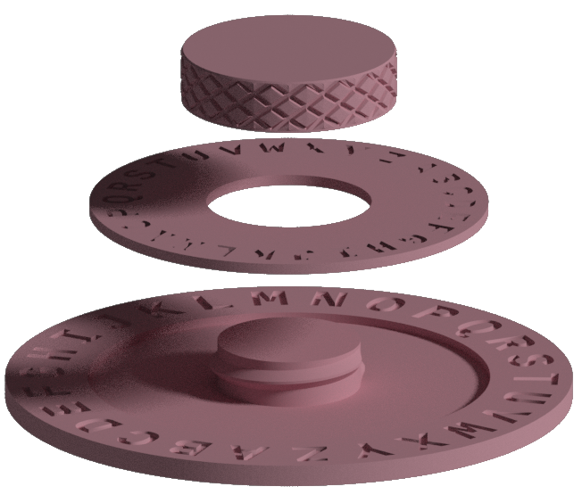
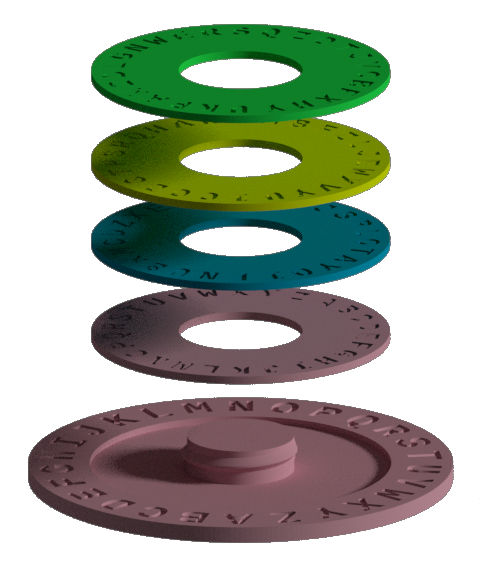

Shift Decoder
===

Summary 
---
A simple rotating shift decoder created to help my nieces "do spy missions". 

<table width="100%">
<tr>
<td width="50%"> </td>
<td width="50%"> </td>
</tr>
</table>
Also gets them to play together, outside, and sometimes the older one even helps the little one with reading. *(Your mileage may vary)*

### Included
  * Decoder Assembly
  * Extra inner rings
	  * Four extra inner rings with text in random order to simulate a salts 
  * [Instructions](./docs/decoder.pdf)
  * [Template](./docs/Mission_Template.tex)

### Settings
| Print Setting | Value |
| --- | --- |
| Material | PLA |
| Layer Height | 0.16 |
| Supports | No |
| Raft | No |

